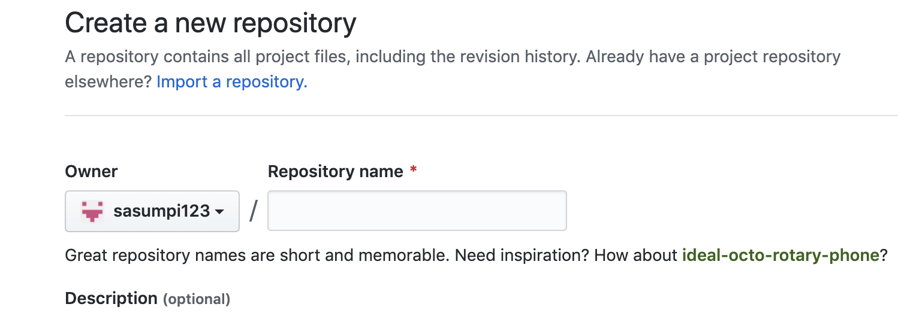

## To-Do List


1. [정적 사이트 생성기 선택하기(`Gatsby`)](https://sasumpi123.github.io/general/gitblog1/)
2. [선택한 정적 사이트 생성기에서 원하는 theme 다운받기](https://sasumpi123.github.io/general/gitblog1/)
3. [`Git Repository` 생성하기](https://sasumpi123.github.io/general/gitblog2/)
4. [Local 환경에서 Test 해보기](https://sasumpi123.github.io/general/gitblog2/)
5. [`Github Action`으로  블로그 배포 자동화하기](https://sasumpi123.github.io/general/gitblog3/)


***      

이전단계를 문제없이 진행하였다면    
`http://localhost:8000/` 에서 블로그를 확인할 수 있다!

이제 자신의 블로그를 다른사람도 볼 수 있게 하기위해 [GitHub](https://github.com/) 에서   
 `Repository`를 생성한다

 

 위 화면까지 왔다면 Repository name 에 자신의아이디.github.io   
 를 입력하여 Repository를 생성한다.   
 ex) 필자의 아이디는 **sasumpi123** 이므로 Repository 이름은   
**sasumpi123.github.io** 가 된다

- Repository를 생성했다면 우리가 파일들을 다운받았던 폴더 `my-blog-starter`에서    
`git bash`를 실행시킨다
이후 
```
rm -rf .git
git init 
```
위 명령어들을 이용해 해당 폴더 Git 정보를 초기화 한다   
- 만약 본인의 OS가 `Window`라면 해당 폴더에서 숨김파일을 볼수있게 한 뒤
.git폴더를 삭제한후 깃 bash에서 
```
git init
```
위 명령어만 실행시켜줘도 무방하다   
- 만약 본인이 `SourceTree`등 GitTool을 사용하고 있다면   
현재 폴더의 파일들을 방금 생성한 `Repository`에 `Commit`후 `Push`하면 되지만   
사용하지 않는 사람들은

```
git add .
git commit -m "Init blog project"
git remote add origin https://github.com/YourID/YourGitRepoName.git
git push -u origin master 
```

위 명령어들로 자신의 `Repository`에 파일들을 `push`한다.

여기까지 문제없이 진행했다면 주소창에 본인깃아이디.github.io 를 입력하면   
gatsby-starter-bee에 관한 README.md 파일이 HTML형식으로 변환된 화면을 볼수있다!

이제 자신의 url에서 포스트를 보기위해 `package.json`, `gatsby-meta-config.js` 파일들을 수정해주어야 한다.

먼저 `package.json`파일을 수정해보자   
`package.json` 파일을 열면 가장 위에보이는 **name**, **description**, **author**, **bugs**    
부분을 자신의 블로그 정보에 맞게 수정해준다   
예시로 보여주는 내용들은 내 블로그 정보들이다.

```js{3}
"name": "sasumpi123.github.io",
  "private": true,
  "description": "MuriMuri's Dev Note",
  "version": "0.1.0",
  "author": "sasumpi123[MuriMUri]<sasumpi123@gmail.com>",
  "bugs": {
    "url": "https://github.com/sasumpi123/sasumpi123.github.io/issues"
  },
```

이후 아래 **67**번라인에 있는 `homepage`,   
**75**번 라인에 있는 `url` 부분을 자신의 블로그 정보에 맞게 수정한다.
ex)   
```js{3}
"homepage": "https://github.com/sasumpi123/sasumpi123.github.io",
"url": "git+https://github.com/sasumpi123/sasumpi123.github.io.git"
```
위 작업을 마치면 `package.json` 파일을 수정해야 할 부분은 99% 끝이난다.   
아직 추가해야할 부분이 있지만 이부분은 추후에 진행할 예정이므로 넘어가자

이제 `gatsby-meta-config.js` 파일을 수정할 차례이다.   
해당 파일에는 Theme 제작자이신 [JaeYeopHan](https://github.com/JaeYeopHan)님 께서 주석을 모두 달아주셨기 때문에 필요한 부분을 자신이 양식에 맞게 수정해주면 끝이난다.


이제 수정한 파일들을 `Repository`에 `Push`한 후 자신의 url로 들어가보면   
자신의 블로그 글을 확인할 수 있다!   

이제 본격적으로 Blog에 Posting을 할수 있는 기반이 마련되었다!   
아래 ~~움짤~~로[JaeYeopHan](https://github.com/JaeYeopHan)님 께서 Posting 하는 방법을 정말 이해하기 쉽게 보여주셨다.


위 ~~움짤~~을 보면서 천천히 따라해보자!   
먼저 터미널 경로를 블로그 폴더 최상위 경로로 설정해 놓은 후,   
```
npm run post
```
명령 어를 입력한뒤 원하는 명령어로 **방향키**와 **엔터**를 통해 실행된 프로세스에서 원하는 행동을 수행할 수 있다.  
Create Category를 선택후 **엔터**를 입력하면 Category명을 입력할 수 있고 입력후 포스트 제목을 입력 할 수 있다.   
이후 모든 작업이 완료되면 
`/content/blog/`경로에 자신이 만든 Category명으로 폴더가 생성되고 안에
자신이 입력한 제목의 마크다운 문서가 만들어져 있는 것을 확인 할 수 있다.   
이제 만들어진 `파일명.md` 파일에 마크다운문법을 이용해 글을 작성하면 된다!

이후 작성된 글을 확인하고 싶다면 `VS Code`, `Atom`등 자신이 주로 사용하는 편집기를 사용해서 확인하거나,    `npm start`명령어를 활용하여 
`http://localhost:8000/` 에서 글들을 확인할 수 있다!


## 출처
[JaeYeopHan/gatsby-starter-bee](https://github.com/JaeYeopHan/gatsby-starter-bee)