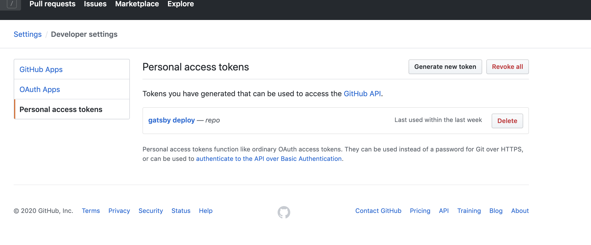
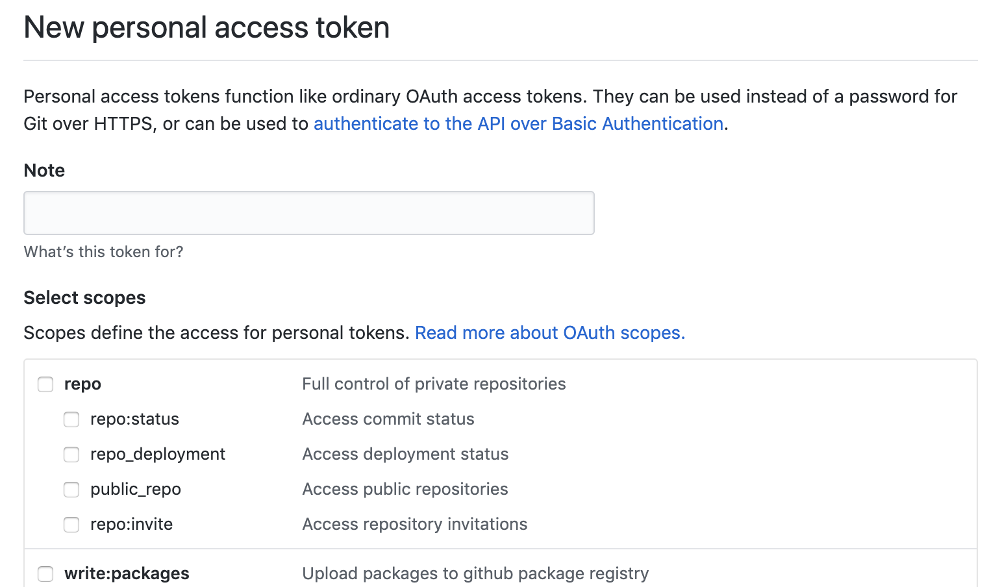
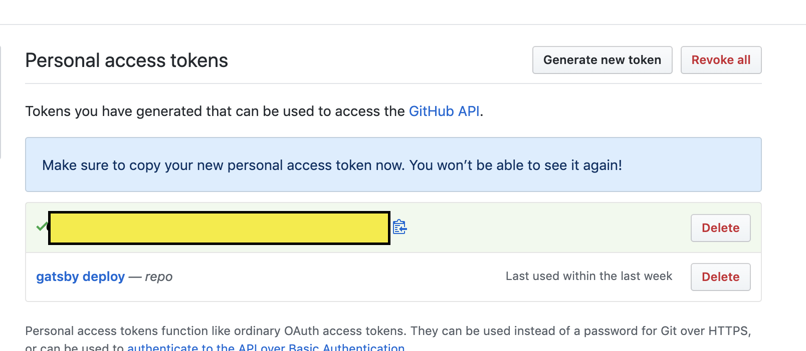

## To-Do List


1. [정적 사이트 생성기 선택하기(`Gatsby`)](https://sasumpi123.github.io/general/gitblog1/)
2. [선택한 정적 사이트 생성기에서 원하는 theme 다운받기](https://sasumpi123.github.io/general/gitblog1/)
3. [`Git Repository` 생성하기](https://sasumpi123.github.io/general/gitblog2/)
4. [Local 환경에서 Test 해보기](https://sasumpi123.github.io/general/gitblog2/)
5. `Github Action`으로  블로그 배포 자동화하기
6. Posting 시작하기


***      
이전단계까지 문제없이 진행했다면 글을 작성하고 마스터에 `Push` 하면   
자신의 `Url`에 해당 글들이 업로드되는걸 확인 할 수 있다.

필자는 글을 작성할 새로운 브랜치를 생성하여 해당 브랜치에 `Push`하면   
자동으로 `Master` 에 자동으로 머지되어 배포되게끔 하고싶었다.    
해당내용을 토대로 검색을 하던 도중 딱 내게 맞는 포스트를 발견하여
해당글을 참고하여 포스팅하려한다.

먼저 배포 자동화를 진행하려면 `GitHub Action` 을 알아야한다.
## GitHub Action
깃허브 저장소 내에서 코드 프로젝트를 `빌드`, `테스트`, `패키지`, `릴리스` 또는 `배포`하기 위해 설정할 수있는 사용자 지정 자동화 프로세스이다.   


```
# This is a basic workflow to help you get started with Actions

name: CI

# Controls when the action will run. Triggers the workflow on push or pull request
# events but only for the master branch
on:
  push:
    branches: [ master ]
  pull_request:
    branches: [ master ]

# A workflow run is made up of one or more jobs that can run sequentially or in parallel
jobs:
  # This workflow contains a single job called "build"
  build:
    # The type of runner that the job will run on
    runs-on: ubuntu-latest

    # Steps represent a sequence of tasks that will be executed as part of the job
    steps:
    # Checks-out your repository under $GITHUB_WORKSPACE, so your job can access it
    - uses: actions/checkout@v2

    # Runs a single command using the runners shell
    - name: Run a one-line script
      run: echo Hello, world!

    # Runs a set of commands using the runners shell
    - name: Run a multi-line script
      run: |
        echo Add other actions to build,
        echo test, and deploy your project.
```

위 내용은 `GitHub Action` 을 정의하는 코드들이다.   
가장 처음에 Set up a workflow yourself 버튼을 클릭하면      
자동으로 생성되는 코드들이다.

먼저 `GitHub Action`을 사용하여 내 `Repository`에 접근하기 위해    
`Token`을 생성하여 적용시켜주어야 한다.

[토큰생성하기!!](https://github.com/settings/tokens)
위 링크로 들어가면   

위와 같은 화면이 나올것이다.    
여기서 `Generate new token` 버튼을 누르면 `Token` 생성하는 화면이 나올것이다.


여기서 Note 부분에 자신이 정하고싶은 이름을 적어주면되고    
`scopes`는 `repo` 모든박스들을 체크해주면 된다.   
아래에 추가적으로 다양한 권한을 부여할수있지만 필자는 `Repository` 에 관련된
권한만 추가하였다.   
위 작업을 끝낸뒤 아래로 내려가 create 버튼을 누르면

위 노란 박스안에 자신이 사용할 키가 생성된다.
위 키를 복사해놓자!.


이제 생성한 `Token`을 적용해보자   
자신의 `Repository`에서 `Settings` -> `Secrets` 탭으로 들어간 후   
새로운 키를 생성해주면 된다.   
Name 부분에 자신이 사용할 이름을 적어주면되고,   
아까 복사해둔 `Token` 값들을 `Value`부분에 넣어주면된다.   
필자는 `GITHUB` 이라는 이름으로 생성하였다.

이젠 Workflow를 생성해 주면 된다. 자신의 `Repository`에서 `Action` 버튼을 눌러보자   
왼쪽 상단에서 `New workflow` 버튼을 눌러주면 다양한 예제들을 확인 할 수 있다.   
이 페이지에서 오른쪽 상단에 skip this : 하고 set up a workflow yourself 버튼을 눌러   
우리가 새용할 Action을 정의하면된다.

처음 화면에 아까 필자가 위에 적어둔 코드들이 보일것이다.   
해당 내용들을
```
on:
  push:
    branches:
      - gh-pages
name: build gatsby
jobs:
  build_gatsby:
    name: build
    runs-on: ubuntu-latest
    steps:
      - uses: actions/checkout@v1

      - name: yarn install
        run: yarn install

      - name: gatsby build
        env:
          GH_API_KEY: ${{ secrets.GITHUB }}
        run: yarn build

      - name: deploy
        uses: maxheld83/ghpages@v0.2.1
        env:
          GITHUB_TOKEN: ${{ secrets.GITHUB_TOKEN }}
          GH_PAT: ${{ secrets.GITHUB }}
          BUILD_DIR: 'public/'
```
로 바꿔준다.   
이떄 `braches` 는 자신이 글을 작성하는 브랜치 이름으로 해준 후   
`Start commit` 버튼을 누른후 `Commit` 메세지를 입력후 `Push`하면 된다.
이제 해당 내용을 자신의 로컬폴더로 `Pull` 받는다.

마지막으로 자신의 `package.json` 파일에서 제일 마지막 scripts 부분에
```
"deploy": "gatsby build && 작업하는브랜치이름 -d public -b master"
```
위 내용을 추가해주면 된다. 필자의 브랜치이름은 `gh-pages`이기때문에
```
"deploy": "gatsby build && gh-pages -d public -b master"
```
위 내용을 추가해주었다.
모든 작업을 마무리하고 새로만든 브랜치에서 파일들을 `Push`한후   
자신의 `Repository`에서 `Action` 탭을 확인해보면

위처럼 노란색 원이 돌고있을것이다. 이 원이 초록색 체크모양으로 변하면   
작업한 브랜치에서 `Master`로 `Merge`가 성공적으로 끝난것이고    
잠시후 자신의 블로그를 확인해보면   
정상적으로 작성한 글들이 업로드 된 것을 확인할수있다.

이젠 MarkDown 문법을 사용하여 글들을 작성하고 작업하는 브랜치에 `Push` 하면   
블로그 글들을 자동 배포할수있다!
   