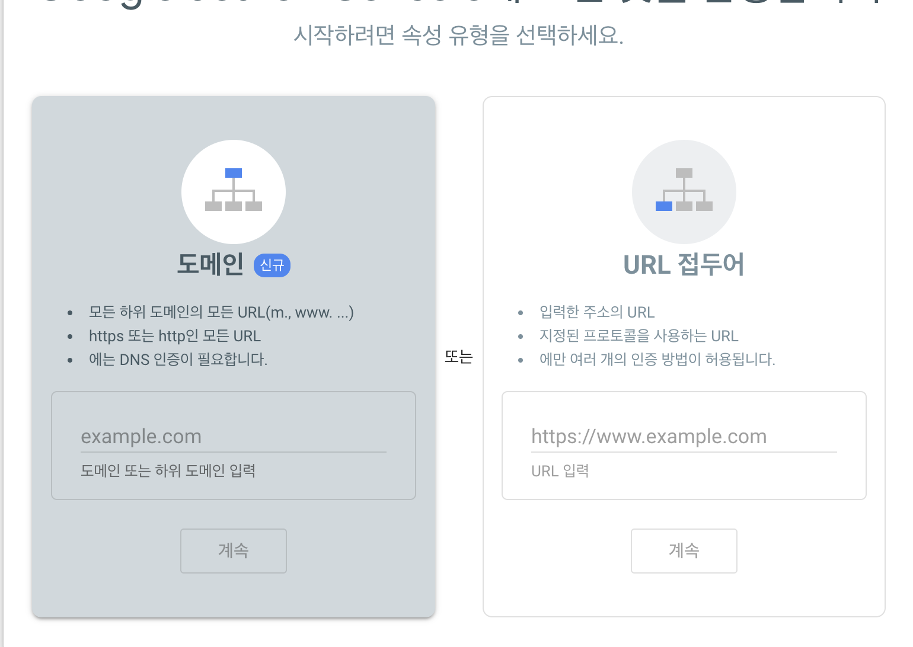
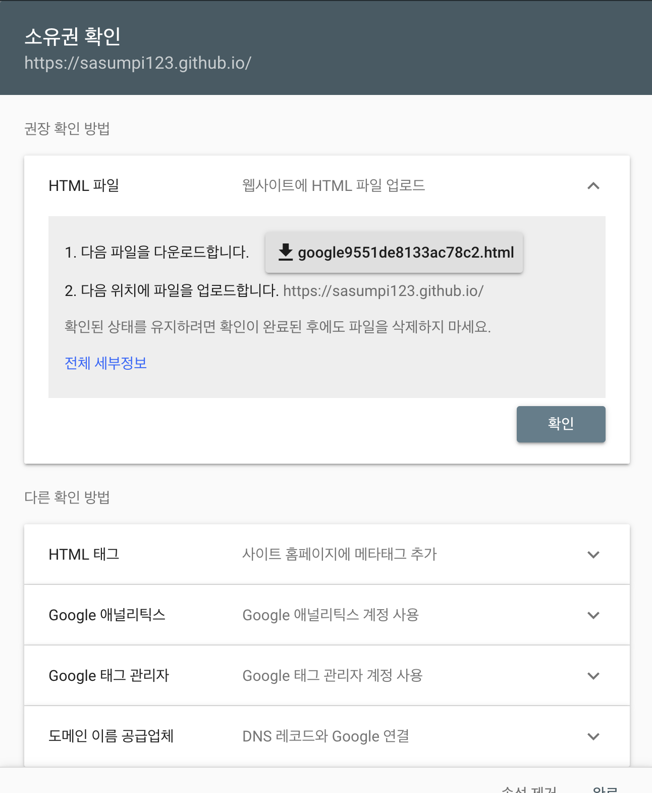
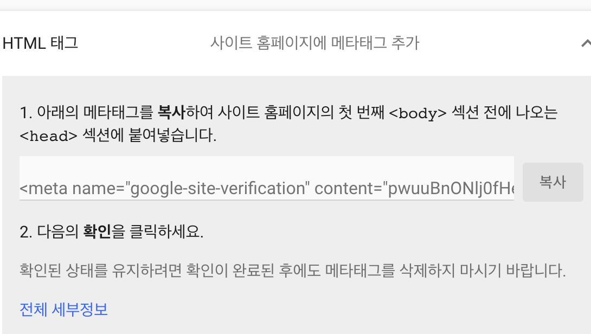
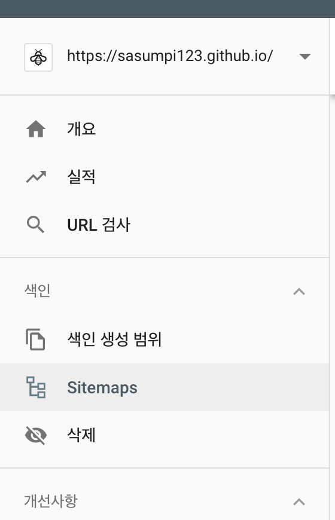

이전단계까지 문제없이 진행했다면 현재는 다들 블로그 운영을 시작했을것이다.   
이제부터는 블로그 덧붙일 수 있는 여러가지 기능들을 추가하려한다.

## Google Search Console이란? ## 
검색엔진 Google에 내 사이트를 등록하여 더 많은 방문자가 생기도록 도와주는 것이다.   
무료이며 기본적으로 구글 계정이 필요하다.


1. Google Search Console 사이트에 접속한다   
[구글서치콘솔](https://search.google.com/search-console/about?hl=ko)<-
링크로 들어가면 시작하기 버튼이 보일것이다. 눌러보자   
구글서치콘솔이 처음이라면 아래화면이 보일것이다.   



우리는 아직 블로그에 도메인을 연동해놓지 않았기 때문에 오른쪽 URL접두어 부분에서 등록해주면된다.   
오른쪽에 우리 블로그 링크를 입력하고 계속을 누르자


이제 구글서치콘솔이 우리사이트를 확인하기위해 소유권을 확인하라고 할것이다.   
소유권을 확인받기위한 방법도 여러가지 있지만 필자는 `HTML`태그를 추가하는방식을 사용했다.



태그를 사용하면 `head`섹션에 구글서치콘솔에서 제공하는 코드를 입력해주면된다.

우리블로그에서 `head`는 아래 경로에 있는 index.jsx에서 수정할 수 있다.
```
/src/components/head/index.jsx
```
해당 파일을 열어 `Head` 함수 안에서 `meta`부분에 
```js{3}
{
    name: "google-site-verification",
    content: "복사한 내용"
},
```
위 내용을 추가해 주면 된다 `content:` 이부분에는 복사한 내용에서 `content=""`   
쌍따옴표 안에 있는 내용들을 붙여넣기 해주면 된다.   
위처럼 `index.jsx`파일을 수정한 후 먼저 `Push` 를 통해 운영하고 있는 블로그에 정보를 적용시켜준다   
업데이트 한 내용이 블로그에 적용된것을 확인 한 후 다시 구글서치콘솔 사이트로 돌아와서   
확인버튼을 눌러주면 우리의 사이트를 구글에서 인증을 완료한 후 본격적으로   
`Google Search Console` 의 다양한 기능들을 사용할 수 있다.   


왼쪽의 메뉴들 중에서 `Sitemaps`를 눌러준다   
그럼 자신의 페이지 url이 입력되있고 옆에 사이트맵 URL을 입력하라고 할텐데   
`sitemap.xml`   
이라고 입력하고 제출하면된다.
