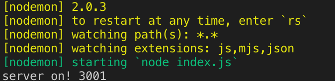

npm모듈을 사용하기 위해 Node.js를 설치한다
>[Node.js 설치](https://nodejs.org/en/)   

설치가 끝나면 아래 명령어를 사용하여 설치후 버전을 확인할 수 있다.
```
node --version
npm --version
```

이제 우리가 작업할 폴더를 만들자 필자는 폴더명을 `MERN`으로 했다.   
이후 `MERN` 폴더에 `server`폴더를 생성한다.   
이제 터미널 혹은 cmd를 켜서 우리가 만든 server로 경로를 잡아주자!   
이후 `server`폴더에서 아래 명령어를 입력한다
```
npm init -y
```

npm init 명령어는 node 프로그램을 시작하는 명령어로 package.json 파일을 생성해 줍니다.   
npm init 옆에 -y는 package.json 파일을 생성하면서 안의 내용들을 모두 기본값으로 정의하겠다는   의미이다.
>package.json 파일은 해당 node 프로그램에 대한 기본 정보를 담고 있는 파일이다.
이제 우리가 server단을 개발할때 필요한 모듈들을 설치하자.
```
npm install express body-parser cors mongoose
npm install nodemon -g
```
위 명령어를 입력하면 `npm`이 `express`, `body-parser`, `cors`, `mongoose`, `nodemon`을 설치할 것이다.
먼저 우리가 설치한 모듈들이 무엇인지 알아보자.

- ### Express   
 `node`에서 제공하는 `Express.js`는 웹 프레임워크이다.   
 더 쉽게 말하자면 웹을 빠르게 개발할 수 있는 편리한, 다양한 도구들의   
 집합체라고 볼 수 있다.

- ### body-parser
 `body-parser` 는 `node.js` 의 `POST` 요청 데이터를 추출할 수 있도록 만들어  > 주는 미들웨어이다. `body-parser`가 없다면 `POST` request data 에서 `undefined`   
 에러를 마주하게 된다.

- ### cors
 `CORS`란 `Cross Origin Resource Sharing`의 약자이다. 즉   
  현재 도메인과 다른 도메인으로 리소스가 요청될 경우를 말한다 우리는 `Front-End` 와   
  `Back-End`의 `PORT` 번호를 다르게 둘것이기 때문에 CORS 제한이 걸리게 된다.    
  이를 해결하기 위해 사용한다.

- ### mongoose
  `Mongoose`는 `Node.js`와 `MongoDB`를 위한 `ODM`(Object Data Mapping)이다.   
  `MongoDB`에서 조회할 때 데이터를 `JavaScript` 객체로 바꿔주는 역할을 한다.

- ### nodemon
    `nodemon`은 프로젝트 폴더의 파일들이 수정될 경우 자동으로 서버를 리로드 시켜준다.   
    `nodemon`이 없다면 `server`폴더안의 파일들이 수정될때마다 서버를 재시작해 주어야하지만   
    `nodemon`을 통해 번거로운 작업을 줄일 수 있다.   
    만약 `MacOS` 에서 -g 설치가 되지 않는다면 sudo su로 관리자 권한으로 설치하거나,   
    -g를 빼고 설치해도 무방하다.   
       


이제 server 폴더안에 index.js 파일을 생성하자.   
이 index.js는 server폴더에서 node의 진입점이 될것이다.     
먼저 express를 사용하여 간단하게 서버를 만들어보자!   

```js{3}
const express = require('express')          // 웹서버 모듈

const app = express()
const port = process.env.PORT || 3001;

app.get('/', (req, res, next) => {
    res.send('hello world!');
});

app.listen(port, function () {
    console.log('server on! ' + port);
});
```
위 내용들을 `index.js`에 입력하고 터미널 혹은 cmd에서    
`nodemon`을 입력하면 아래와 같은 내용이 출력되면서 서버가 켜진것을 확인할 수 있다. 

이제 우리가 간단하게 만든 서버가 켜졌다!!   

인터넷에서 **http://localhost:3001/** 로 들어가보면    
**"hello world!"**를 마주할수있다.

다음포스팅부터 위 코드 분석을 시작으로 최대한 필자가 알고있는것을 전부 적어보려한다.   
파이팅!

